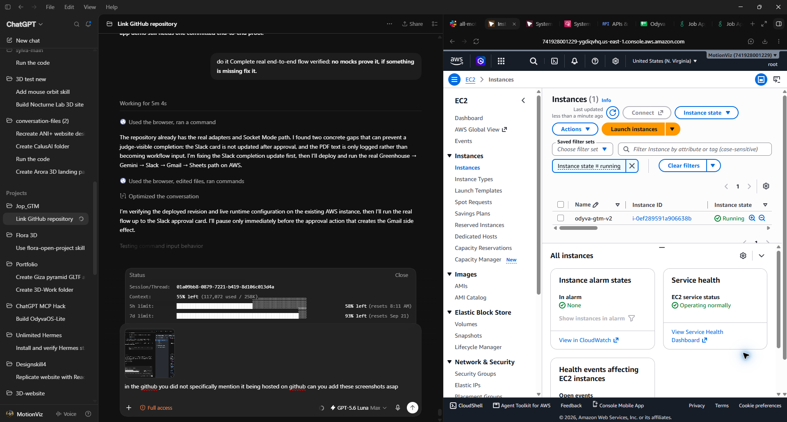
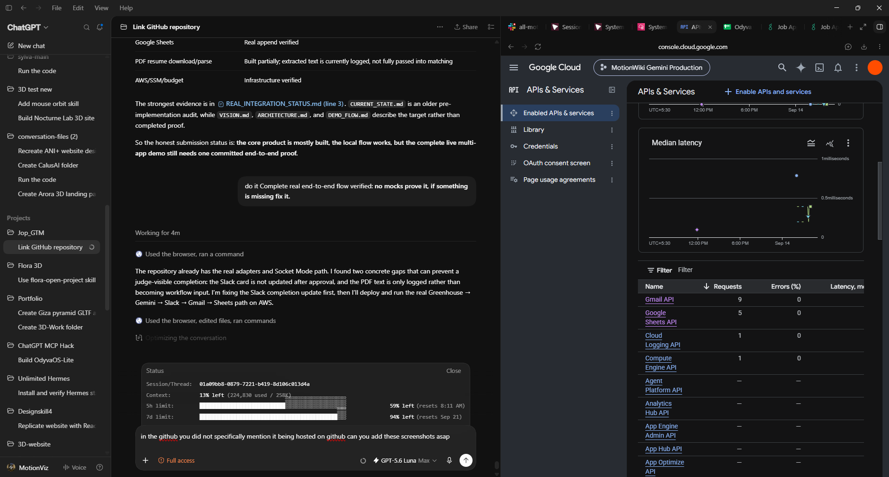
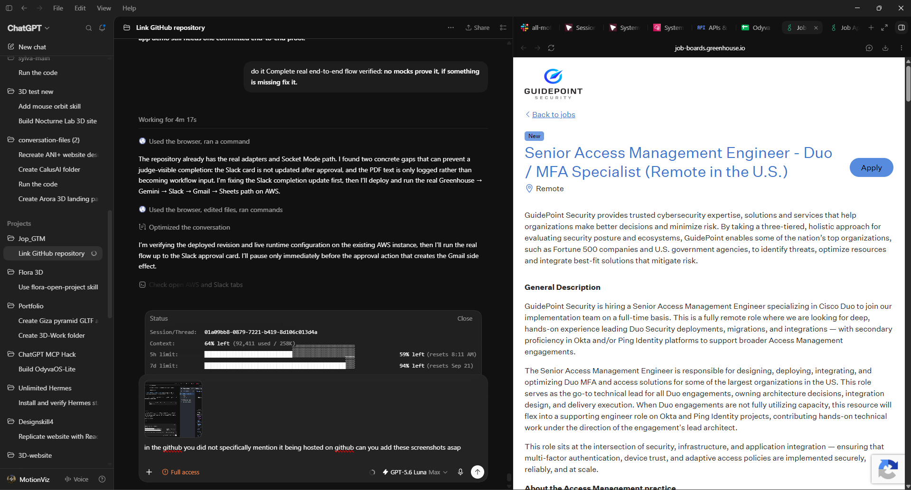
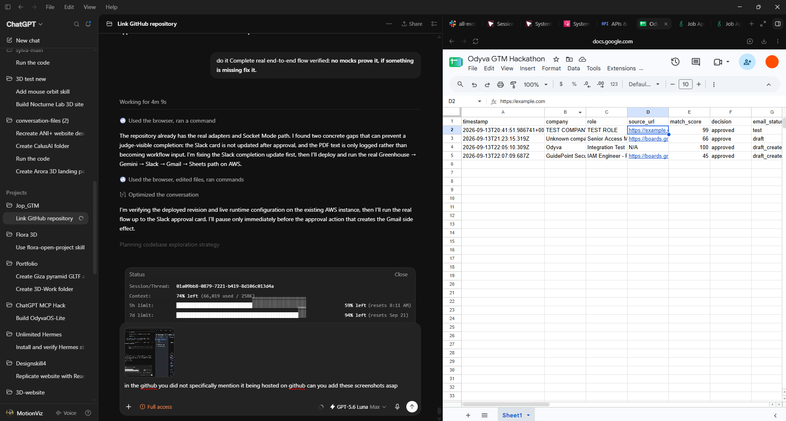

# Odyva GTM

> 24/7 AI-powered GTM search that finds live operational intent, matches it against verified capabilities, prepares the highest-probability conversion action, asks for human approval, executes it, and records the outcome.

## GitHub Repository

This project is hosted on GitHub: [adi0900/Job_GTM](https://github.com/adi0900/Job_GTM).

## Watch the Demo

[](https://youtu.be/l7xBSb0yEX4?autoplay=1)

[Open the demo on YouTube](https://youtu.be/l7xBSb0yEX4?autoplay=1)

---

## Real Integration Proof

The project is hosted in the [Job_GTM GitHub repository](https://github.com/adi0900/Job_GTM). The evidence below is ordered from AWS hosting, to Google services, to the live source signal and recorded result.

### 1. AWS-hosted runtime



### 2. Google Cloud integrations



### 3. Live Greenhouse opportunity



### 4. Google Sheets result



---

## 01. Project Overview

### What we built

Odyva GTM is a multi-app AI agent that continuously looks for companies showing live hiring intent and turns that signal into an actionable, human-approved GTM opportunity.

The core loop is:

```text
Slack
→ Hermes messaging runtime
→ Strands Agents SDK
→ Odyva tools
→ Greenhouse opportunity discovery
→ deterministic capability matching
→ Gemini grounded outreach
→ Slack approval
→ Gmail execution
→ Google Sheets record
```

Instead of asking an AI model to perform disconnected tasks such as:

```text
"research this lead"
"write this email"
"personalize these contacts"
```

Odyva connects the entire workflow.

## Judge Test Invite

Judges can test the public sandbox through Slack without receiving AWS, Google Cloud, or Slack admin credentials.

[Join the Odyva GTM Slack test workspace](https://join.slack.com/t/motionvizworkspace/shared_invite/zt-49lnp3cwn-6g~jo9~Cbzb5U03mHOLALQ)

After joining, open `#odyva-judge-test`, mention `@Odyva GTM`, and type any request—for example, `@Odyva GTM find a matching GTM opportunity`. You can also upload a resume PDF, review the matched opportunity, and choose **Approve + Draft**. The complete safety boundaries and test flow are documented in [Judge Safety Mode](#judge-safety-mode).

It answers:

```text
who needs what we can actually do right now?

how strong is the match?

why is it a match?

what should we send?

should a human approve it?

what happened after execution?
```

### The problem

Early-stage founders still manually move between:

```text
job boards
browser research
AI chat
Slack
Gmail
spreadsheets
```

The intelligence exists.

The operating loop is fragmented.

Odyva connects that loop.

### What makes the signal useful

A live job posting is more than a job listing.

It can indicate:

```text
active budget
+
current operational pain
+
clear capability requirements
+
a company trying to solve the problem now
```

Example:

```text
Company:
Acme

Role:
Founding Growth Engineer

Requirements:
outbound systems
automation
TypeScript
CRM
enrichment
```

Odyva can interpret that as:

```text
Acme is actively investing in growth infrastructure.
```

It then compares that need against a structured capability profile.

### Capability matching

The source of truth is a structured capability profile.

Example:

```json
{
  "positioning": "AI creative director and GTM operator",
  "skills": [
    "AI automation",
    "GTM systems",
    "workflow design",
    "TypeScript"
  ],
  "experience": [],
  "results": [],
  "case_studies": [],
  "constraints": []
}
```

The same profile can later generate an ATS-friendly resume.

For this MVP, the structured profile directly powers matching.

### Opportunity scoring

The MVP uses an explainable score:

```text
score =
  capability fit * 40%
  +
  intent * 30%
  +
  evidence * 20%
  +
  urgency * 10%
```

Example:

```text
92% match

capability fit: 95
intent: 94
evidence: 88
urgency: 85

why:
- role requires outbound automation
- matching GTM systems experience exists
- relevant technical overlap exists
- company is actively hiring now
```

Gemini can assist with extraction and reasoning, but the final score remains decomposable and understandable.

### Human approval

Odyva does not automatically commit the user's reputation to an external buyer.

Slack acts as the human gate:

```text
ODYVA OPPORTUNITY

Company: Acme
Role: Founding Growth Engineer
Match: 92%

Why:
- outbound automation requirement
- strong capability overlap
- active hiring intent

Email:
[generated outreach]

[ Approve + Send ]
[ Reject ]
```

Only approved actions continue to Gmail sending; draft preparation does not send an email.

### Result

After execution, Odyva records the outcome in Google Sheets so the workflow ends with a visible external record.

---

## 02. External Apps Used

Odyva connects to four external apps.

### 1. Greenhouse

**Purpose:** live GTM intent discovery.

Odyva reads real job openings and uses them as current operational signals.

```text
Greenhouse
→ real job
→ normalized opportunity
```

### 2. Slack

**Purpose:** human approval and governance.

Slack displays:

```text
company
role
match score
match reasons
generated outreach
```

The user can:

```text
Approve + Send
Reject
```

### 3. Gmail

**Purpose:** approved outbound execution.

The runtime prepares a real Gmail draft before approval. Only an explicit Slack approval may send it:

```text
prepare draft
Approve + Send → drafts.send → message id
Reject → no send
```

`GMAIL_MODE=live` and `EMAIL_MODE=live` enable the approved send path. The application still refuses to send before approval, and the existing `scripts/gmail-draft.ts` remains available for draft-only operations.

### 4. Google Sheets

**Purpose:** persistent external GTM record.

Odyva appends the final decision and execution status to a Google Sheet.

Suggested row:

```text
timestamp
company
role
source URL
match score
decision
email status
```

### AI + Agent Runtime

The AWS-hosted demo uses the Strands Agents SDK as the canonical GTM orchestration layer. Hermes Agent v0.21.2 remains the Slack-facing conversational runtime and gateway. Strands selects and invokes the existing Odyva tools; it does not replace their integrations or bypass the human approval gate.

```text
Slack
→ Hermes messaging runtime
→ Strands Agents SDK
→ Odyva tools
→ Greenhouse / Gmail / Google Sheets
```

Strands is responsible for model-driven workflow orchestration and tool selection. Hermes is responsible for Slack interaction and runtime access. The existing deterministic matcher remains the source of truth for scores, while Gemini prepares grounded outreach.

**Gemini API**

```text
job pain extraction
capability reasoning
opportunity explanation
outbound generation
```

Sol and Luna are development-only and are not part of the production demo flow.

---

## 03. Setup Instructions

### Prerequisites

You will need:

```text
Node.js / project runtime
Gemini API credentials
Slack app credentials
Gmail API credentials
Google Sheets API credentials
Greenhouse source
```

### 1. Clone the repository

```bash
git clone https://github.com/adi0900/Job_GTM.git
cd Job_GTM
```

### 2. Install dependencies

```bash
npm install
```

### 3. Configure environment variables

Create:

```text
.env
```

from:

```text
.env.example
```

Expected variables may include:

```env
APP_ENV=development

GREENHOUSE_BOARD_TOKEN=
GREENHOUSE_COMPANY=

GEMINI_API_KEY=
GEMINI_MODEL=gemini-3.1-flash-lite

SLACK_BOT_TOKEN=
SLACK_SIGNING_SECRET=
SLACK_CHANNEL_ID=

GMAIL_CLIENT_ID=
GMAIL_CLIENT_SECRET=
GMAIL_REFRESH_TOKEN=

GOOGLE_SHEETS_SPREADSHEET_ID=
GOOGLE_SHEETS_RANGE=Sheet1!A:G
GOOGLE_CLIENT_ID=
GOOGLE_CLIENT_SECRET=
GOOGLE_REFRESH_TOKEN=

GMAIL_MODE=dry_run
EMAIL_MODE=dry_run
```

Only include variables that the final implementation actually requires.

Never commit real secrets.

### 4. Configure Slack

Create or use a Slack app with permission to:

```text
post messages
receive button interactions
```

Set the development channel ID in:

```env
SLACK_CHANNEL_ID=
```

### 5. Configure Gmail

Safe development defaults:

```env
GMAIL_MODE=dry_run
EMAIL_MODE=dry_run
```

For the AWS runtime, use the approval-gated live path:

```env
GMAIL_MODE=live
EMAIL_MODE=live
```

Supported modes are:

```text
dry_run
draft
live
```

In live mode, Odyva creates a real draft first. The Slack **Approve + Send** action sends that existing draft through Gmail `drafts.send`; **Reject** never sends. Live mode must only be enabled where the Slack approval gate is active.

### 6. Configure Google Sheets

Create a spreadsheet for Odyva results.

The sheet should support at least these columns:

```text
timestamp
company
role
source_url
match_score
decision
email_status
```

Add its ID to:

```env
GOOGLE_SHEETS_SPREADSHEET_ID=
```

### 7. Add capability profile

Create or update:

```text
data/capability_profile.json
```

with verified capabilities only.

Do not add invented results or case studies.

### 8. Run the project

```bash
npm start
```

To run the Strands analysis entrypoint with a resume file:

```bash
node --experimental-strip-types scripts/strands-run.ts --resume /path/to/resume.pdf-or-text
```

### 9. Run tests

```bash
npm test
```

The repository also provides a syntax check for the main entrypoint:

```bash
npm run check
```

---

## 04. Reliability Testing

Reliability is a core part of the project.

We test both the happy path and failure paths.

### Test 1: Happy Path

Flow:

```text
Greenhouse
→ match
→ Gemini
→ Gmail draft
→ Slack approval
→ Gmail drafts.send
→ Google Sheets
```

Expected:

```text
one opportunity
one approval
one email action
one Google Sheets row
successful final state
```

### Test 2: Reject Path

Flow:

```text
opportunity
→ Slack
→ Reject
```

Expected:

```text
zero Gmail sends (a draft may already exist, but it is never sent)
decision recorded
```

### Test 3: Duplicate Approval Protection

Flow:

```text
same action approved twice
```

Expected:

```text
one draft and at most one Gmail send
```

This prevents duplicate outbound caused by repeated interactions or retries.

### Test 4: Gemini Failure

Simulated condition:

```text
invalid / unavailable model response
```

Expected:

```text
workflow fails safely
no Gmail execution
no false success state
```

### Test 5: Gmail Failure

Simulated condition:

```text
Gmail execution fails
```

Expected:

```text
error is surfaced
execution is not reported as successful
duplicate sends are prevented
```

### Test 6: Google Sheets Failure

Simulated condition:

```text
Google Sheets write fails
```

Expected:

```text
failure is visible
the system does not silently report a complete workflow
```

### Verification Results

```text
test command: npm test
tests passing: 15
tests failing: 0
manual happy-path verification: AWS-hosted integrations verified; Strands live invocation is verified separately at runtime
manual reject-path verification: covered by the existing flow tests
duplicate-send verification: covered by the existing flow tests
```

Do not claim tests that were not actually run.

---

## 05. Demo Video

**Demo video:** [Watch the Odyva GTM demo](https://youtu.be/l7xBSb0yEX4)

[](https://youtu.be/l7xBSb0yEX4)

Requirements:

```text
maximum duration: 2 minutes
publicly accessible to judges
```

Recommended demo sequence:

```text
0:00-0:15
show the problem + start live search

0:15-0:35
show a real Greenhouse opportunity

0:35-0:55
show capability match + score

0:55-1:15
show Gemini-generated reasoning + outreach

1:15-1:35
show Slack approval

1:35-1:50
show Gmail execution

1:50-2:00
show Google Sheets row + final thesis
```

---

# Architecture

The hackathon architecture intentionally stays small.

```text
Slack
   ↓
Hermes messaging runtime
   ↓
Strands Agents SDK
   ↓
Odyva tools
   ├── greenhouse_search → Greenhouse
   ├── match_resume → deterministic matcher + capability profile
   ├── prepare_outreach → Gemini
   ├── create_gmail_draft → Gmail
   └── append_gtm_record → Google Sheets
   ↓
Slack approval remains the human gate before Gmail execution
```

Suggested repo shape:

```text
odyva-gtm/
├── AGENTS.md
├── README.md
├── docs/
│   ├── VISION.md
│   ├── ARCHITECTURE.md
│   ├── CURRENT_STATE.md
│   └── DEMO_FLOW.md
├── src/
│   ├── index.ts
│   ├── greenhouse.ts
│   ├── matcher.ts
│   ├── strands-agent.ts
│   ├── hermes.ts
│   ├── gemini.ts
│   ├── slack.ts
│   ├── gmail.ts
│   ├── sheets.ts
│   └── storage.ts
├── data/
│   ├── capability_profile.json
│   └── results.json
├── tests/
│   └── flow.test.ts
├── scripts/
│   ├── gmail-draft.ts
│   └── gmail-send.ts
├── .env.example
├── package.json
└── tsconfig.json
```

---

# Safety

## Judge Safety Mode

The public demo runs in a sandboxed judge environment.

- Slack access is allowlisted.
- Greenhouse access is read-only.
- Gmail is restricted to draft creation only.
- Google Sheets writes only to a dedicated judge spreadsheet.
- No production customer data is used.
- Uploaded resumes are isolated per run.
- Secrets are stored only in server-side environment variables.
- Judges do not receive AWS, Google Cloud, or Slack admin credentials.
- External side effects require explicit human approval in Slack.

Judge test flow:

1. Join `#odyva-judge-test`.
2. Upload a resume PDF.
3. Mention `@Odyva GTM` and ask it to run the GTM workflow.
4. Review the matched Greenhouse opportunity.
5. Click **Approve + Draft**.
6. Verify the Gmail draft and Google Sheets row.

The most important rule is: judges should test through Slack, not by receiving your AWS/GCP credentials. For the safest possible setup, use a dedicated test Gmail account, a dedicated sheet, and a dedicated Slack channel, then revoke temporary tokens immediately after judging.

Judge mode remains draft-only. The separate AWS runtime may use live Gmail execution, but only through the explicit Slack approval gate described above.

## Current Hackathon Runtime

Hermes Agent v0.21.2 is installed on AWS and remains the Slack-facing runtime and gateway. The canonical GTM analysis path now invokes the Strands Agents SDK, which selects the existing Odyva tools and keeps the deterministic matcher and external integrations in place. `prepare_outreach` reuses the existing direct Gemini adapter; Gmail and Google Sheets remain behind the existing approval-controlled execution path.

The loaded Strands tools are:

```text
greenhouse_search
match_resume
prepare_outreach
create_gmail_draft
append_gtm_record
```

External apps:

```text
Greenhouse
Slack Socket Mode
Gmail (approval-gated live send)
Google Sheets
```

AI:

```text
Gemini (gemini-2.5-flash-lite)
```

Hosting:

```text
AWS EC2
```

The final demo path is:

```text
Slack
→ Hermes messaging runtime
→ Strands Agents SDK
→ real Greenhouse job
→ deterministic capability matcher
→ direct Gemini API
→ Slack approval
→ Gmail draft
→ approved Gmail drafts.send
→ Google Sheets row
```

Development defaults should remain safe.

```env
APP_ENV=development
GMAIL_MODE=dry_run
EMAIL_MODE=dry_run
```

Rules:

```text
no live email without approval
no secrets committed
no invented capability evidence
no silent external-app failures
no duplicate email execution
```

---

# What We Intentionally Did Not Build

This is a hackathon MVP.

We intentionally avoided spending demo time on:

```text
microservices
SQS
EventBridge
dead-letter queues
multi-tenancy
full CRM abstraction
distributed tracing
full memory graph
multiple AI providers
complex event sourcing
production autoscaling
```

The objective is to prove the useful multi-app agent loop first.

---

# Future Direction

Post-hackathon, Odyva can expand into:

```text
24/7 scheduled search
multiple intent sources
ATS-friendly resume generation
persistent brand memory
CRM integrations
historical conversion learning
AWS workers
multi-tenant workspaces
automated opportunity reprioritization
```

The core thesis remains:

```text
find who needs what you can actually do
→ prove the fit
→ prepare the action
→ keep the human accountable
→ execute
→ record what happened
```
